<div align="center">

# wunderunner

### AI-Powered Docker Configuration Generator

**Analyze your project, generate Dockerfiles & docker-compose.yaml, and learn from build errors with AI.**

<p align="center">
  <a href="https://github.com/wunderlabs/wunderunner">
    
  </a>
  <a href="https://github.com/wunderlabs/wunderunner?tab=MIT-1-ov-file">
    
  </a>
  <a href="https://github.com/wunderlabs/wunderunner">
    
  </a>
</p>

</div>

---

<table>
<tr>
<td>

**wunderunner (`wxr`)** is a CLI tool that uses AI agents to analyze your codebase and generate production-ready Docker configurations. Point it at any project and it figures out the rest: scanning your dependencies, generating optimized Dockerfiles, and building containers.

**Self-healing by design.** When builds fail, wunderunner doesn't just report errors. It analyzes logs, identifies the root cause, fixes the configuration, and tries again. This iterative loop continues until your container runs successfully or the issue requires human intervention.

Built with [Pydantic AI](https://ai.pydantic.dev/) for structured agent workflows. Inspired by [Repo2Run](https://github.com/bytedance/Repo2Run) and [Railpack](https://github.com/railwayapp/railpack).

</td>
</tr>
</table>

---

## Quick Start

```bash
# Set your API key
export ANTHROPIC_API_KEY=sk-ant-...

# Run on any project
uvx wunderunner /path/to/your/project
```

That's it. wunderunner analyzes your project and generates Docker configs.

---

## How It Works

```mermaid
flowchart TD
    Analyze[🔍 Analyze Project] --> secrets{Secrets?}
    secrets -->|yes| CollectSecrets[🔐 Collect Secrets]
    secrets -->|no| Dockerfile
    CollectSecrets --> Dockerfile

    Dockerfile[📄 Generate Dockerfile] --> Validate[✅ Validate]
    Validate -->|pass| Services[🐳 Generate Compose]
    Validate -->|fail| RetryOrHint
    Services -->|success| Build[🔨 Build Image]
    Services -->|fail| RetryOrHint
    Build -->|success| Start[🚀 Start Containers]
    Build -->|fail| RetryOrHint
    Start -->|success| Healthcheck[💓 Healthcheck]
    Start -->|fail| RetryOrHint
    Healthcheck -->|healthy| Success((✨ Success))
    Healthcheck -->|fail| RetryOrHint

    RetryOrHint{Retry?} -->|validation/generation error| Dockerfile
    RetryOrHint -->|runtime error| ImproveDockerfile[🔧 Improve Dockerfile]
    RetryOrHint -->|exhausted| HumanHint[💬 Ask Human]

    ImproveDockerfile -->|fixed| Validate
    ImproveDockerfile -->|compose modified| Build
    ImproveDockerfile -->|low confidence| HumanHint

    HumanHint --> Dockerfile
```



**The loop continues until success.** Each failure feeds back as a learning, informing the next generation attempt with specific context about what went wrong and how to fix it.

---

## Features

| Feature | Description |
|---------|-------------|
| **Project Analysis** | Reads package.json, requirements.txt, Cargo.toml, go.mod, and more |
| **Smart Defaults** | Chooses appropriate base images, build stages, and runtime configs |
| **Self-Healing Builds** | Automatically diagnoses failures, fixes configs, and retries |
| **Iterative Learning** | Each error informs the next attempt until the build succeeds |

---

## Key Concepts

### Human in the Loop

When automatic retries are exhausted, wunderunner asks for help instead of giving up. You provide a hint, maybe the project needs a specific system dependency, or uses an unconventional setup. Your hint becomes part of the context for the next attempt.

```
❌ Build failed after 3 attempts
💬 What should I know about this project?
> This uses puppeteer and needs chromium installed

✓ Got it. Retrying with that context...
```

### Learnings & Context

Every failure teaches the system something. Learnings accumulate across retry cycles:

- **Phase**: Where it failed (build, start, healthcheck)
- **Error type**: What kind of failure occurred
- **Error message**: The actual error output
- **Context**: Additional info (previous fixes tried, human hints)

The Dockerfile generator receives all learnings, allowing it to avoid repeating mistakes and build on what worked.

### Caching

Analysis results are cached in `.wunderunner/` to avoid re-scanning unchanged projects:

```bash
wxr /path/to/project           # Uses cache if available
wxr /path/to/project --rebuild # Ignores cache, fresh analysis
```

Cached artifacts:
- Project structure analysis
- Detected runtime and framework
- Environment variables and secrets
- Generated Dockerfile and docker-compose.yaml

### Runtime Healing

Failures during build, start, or healthcheck trigger the **ImproveDockerfile** agent. This unified agent can:

- Modify the Dockerfile (add missing packages, fix commands)
- Modify project files (remove problematic configs like `.babelrc`)
- Update docker-compose.yaml (fix port mappings, remove bad volumes)
- Add `.dockerignore` entries to exclude conflicting files

The agent reads error messages carefully and applies targeted fixes. If it modifies docker-compose.yaml, it skips regeneration and goes directly to build.

---

**License:** MIT | **Python:** 3.11+ | **CLI:** `wxr`
